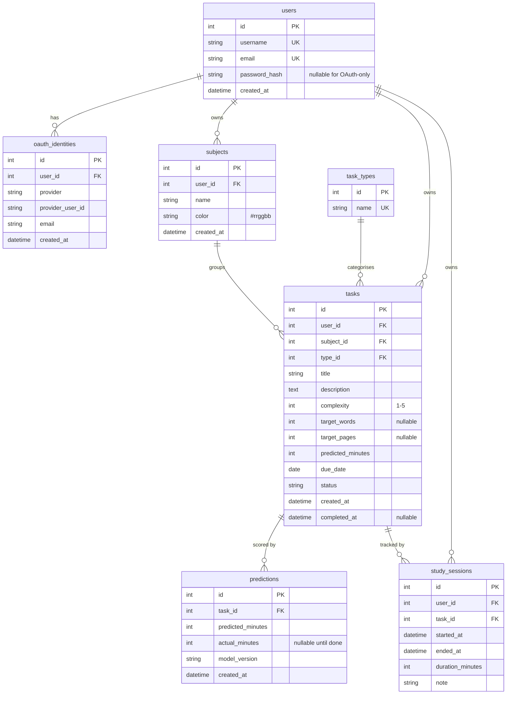

# Stride

A personal study-tracking web app that predicts how long your tasks will take, based on a model trained on your own past study sessions.


## Tech stack

- Python 3.11 (tested on 3.10), Flask 3
- SQLite via Flask-SQLAlchemy
- Flask-Login + Werkzeug for authentication; Authlib for OAuth
- Flask-WTF + WTForms (with `email-validator`) for forms and CSRF
- Bootstrap 5 (CDN) + Chart.js (CDN) for the front end
- scikit-learn + pandas + numpy for the regression predictor

## Database schema

Six user-scoped tables plus a global `task_types` lookup. All foreign keys cascade where appropriate.



| Table | Purpose |
|---|---|
| `users` | accounts (Werkzeug-hashed password, nullable for OAuth-only users; unique username + email) |
| `oauth_identities` | links a user to one external identity at an OAuth provider (currently Google); unique on (provider, provider_user_id) |
| `subjects` | per-user subject list, unique-by-(user_id, name), with hex colour |
| `task_types` | global lookup seeded with Reading, Essay, Problem Set, Coding, Revision, Other |
| `tasks` | the work the user is tracking |
| `study_sessions` | logged time against a task; summed into `predictions.actual_minutes` on completion |
| `predictions` | one row per task, written on save with the predictor's estimate; `actual_minutes` and `model_version` make this the audit trail for prediction accuracy |

## Project structure

```
stride/
├── app.py                  entry point: flask --app app.py run --debug
├── config.py               Config + TestConfig
├── requirements.txt
├── requirements-dev.txt
├── pyproject.toml          ruff config
├── pytest.ini
├── .env.example
├── README.md
├── instance/               SQLite db + per-user model pickles (gitignored)
├── tests/                  pytest suite against in-memory SQLite
└── stride/
    ├── __init__.py         create_app factory + init-db / seed-demo CLI
    ├── extensions.py       db, login_manager, csrf, oauth singletons
    ├── models.py           User, OAuthIdentity, Subject, TaskType, Task, StudySession, Prediction
    ├── auth/               /auth/signup, /auth/login, /auth/logout, /auth/oauth/google/*
    ├── subjects/           /subjects CRUD
    ├── tasks/              /tasks CRUD + status transitions
    ├── sessions/           /sessions/task/<id>/new, /sessions/<id>/delete
    ├── dashboard/          /dashboard
    ├── planner/            /planner — two-week distribution
    ├── calendar/           /calendar — monthly grid
    ├── insights/           /insights — accuracy charts and streak
    ├── account/            /account — profile + password + linked accounts
    ├── ml/                 predictor.py, features.py, trainer.py
    ├── templates/          base.html + per-blueprint subfolders + errors/
    └── static/             css/style.css + js/app.js
```

## Tests

```bash
pip install -r requirements-dev.txt
python -m pytest tests/
```

The suite uses an in-memory SQLite database via `TestConfig`, so each
test gets a clean schema. Run-time: under 10 seconds.
