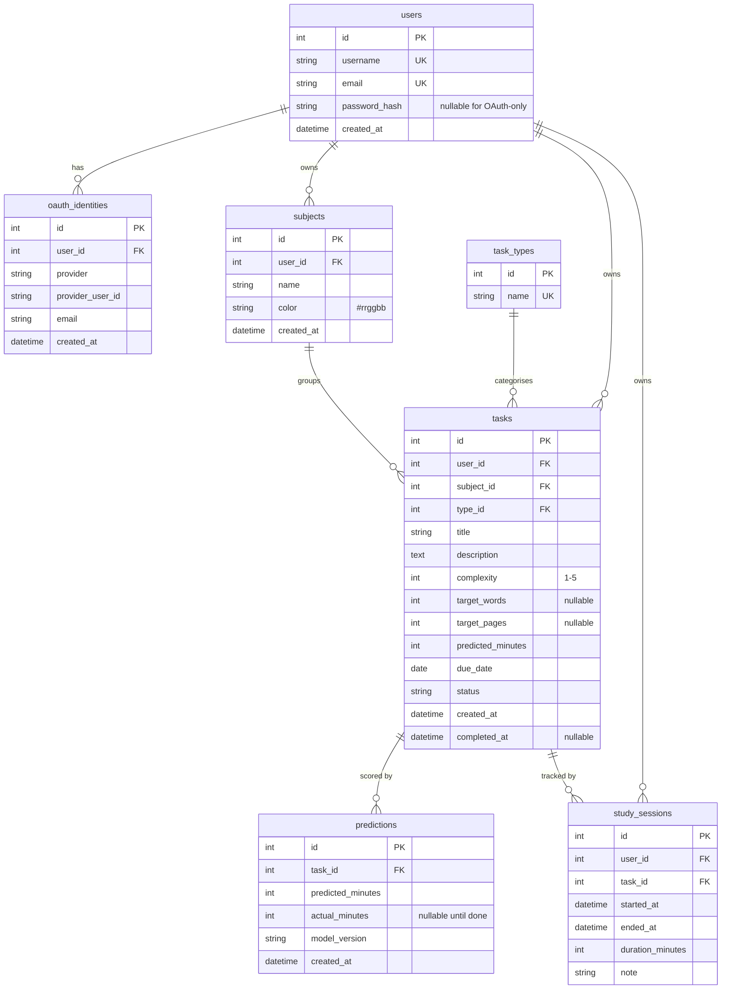

# Stride

A personal study-tracking web app that predicts how long your tasks will take, based on a model trained on your own past study sessions.

Built for the ITDS620 *Programming Languages and Software Development* summative assessment.


## Features

- **Tasks**: tag each task with subject, type, and complexity 1–5; add target words / pages where relevant.
- **Sessions**: log study time against a task; durations are summed into an "actual minutes" figure on completion.
- **Predictor (two layers)**:
  - A heuristic baseline using a per-type table (`Reading: 3 min × pages × (0.7 + 0.15c)` etc.).
  - A per-user Ridge regression that takes over after the user has 5+ completed tasks. Trained on every task completion, pickled to `instance/model_<user_id>.pkl`. Sanity-guarded: a regression prediction below the 15-minute floor or more than 3× the heuristic falls back to the heuristic.
- **Dashboard**: KPIs (hours total, hours this week, open tasks, done tasks), pie chart by subject, bar chart by day-of-week, due-soon table.
- **Smart planner**: distributes each open task's remaining minutes evenly across the days from today to its due date (next 14 days).
- **Insights**: streak, best study day, predicted-vs-actual scatter with `y=x` reference, signed-delta drift line, by-subject totals and averages.
- **Authentication**: Werkzeug password hashing, Flask-Login session management, CSRF on every POST. Every database query filters by `user_id == current_user.id`, and routes use `first_or_404()` so cross-user access is indistinguishable from a missing row. Session cookies are `HttpOnly`, `SameSite=Lax`, and `Secure` in production; `session_protection="strong"` rotates the session id on IP/User-Agent change.
- **Google sign-in (optional)**: federated login alongside username/password. Uses Authlib for OpenID Connect; a separate `oauth_identities` table maps `(provider, provider_user_id)` to a `User`. The schema is provider-agnostic so additional providers can be wired up later without a migration.

## Tech stack

- Python 3.11 (tested on 3.10), Flask 3
- SQLite via Flask-SQLAlchemy
- Flask-Login + Werkzeug for authentication; Authlib for OAuth
- Flask-WTF + WTForms (with `email-validator`) for forms and CSRF
- Bootstrap 5 (CDN) + Chart.js (CDN) for the front end
- scikit-learn + pandas + numpy for the regression predictor

## Setup

```bash
# 1. cd into the project
cd stride

# 2. Create and activate a virtual environment
python3 -m venv venv
source venv/bin/activate            # macOS / Linux
# .\venv\Scripts\activate            # Windows PowerShell

# 3. Install dependencies
pip install -r requirements.txt

# 4. Configure environment
cp .env.example .env
# Edit .env and set SECRET_KEY to a long random string. Generate one with:
#   python -c "import secrets; print(secrets.token_hex(32))"

# 5. Initialise the database (creates tables and seeds the task type lookup)
flask --app app.py init-db

# 6. (Optional) Seed a demo user with 25 completed tasks across 4 subjects
flask --app app.py seed-demo
# Logs in as: demo / Demo1234!

# 7. Run the dev server
flask --app app.py run --debug
# Open http://127.0.0.1:5000
```

## Deployment

See [`DEPLOY.md`](DEPLOY.md) for step-by-step PythonAnywhere and Render
instructions.

## Database schema

Six user-scoped tables plus a global `task_types` lookup. All foreign
keys cascade where appropriate.



| Table | Purpose |
|---|---|
| `users` | accounts (Werkzeug-hashed password, nullable for OAuth-only users; unique username + email) |
| `oauth_identities` | links a user to one external identity at an OAuth provider (currently Google); unique on (provider, provider_user_id) |
| `subjects` | per-user subject list, unique-by-(user_id, name), with hex colour |
| `task_types` | global lookup seeded with Reading, Essay, Problem Set, Coding, Revision, Other |
| `tasks` | the work the user is tracking |
| `study_sessions` | logged time against a task; summed into `predictions.actual_minutes` on completion |
| `predictions` | one row per task, written on save with the predictor's estimate; `actual_minutes` and `model_version` make this the audit trail for prediction accuracy |

## Project structure

```
stride/
├── app.py                          entry point: flask --app app.py run --debug
├── config.py                       Config + TestConfig
├── requirements.txt
├── requirements-dev.txt            extra: pytest, pytest-cov, ruff, mypy
├── pyproject.toml                  ruff + mypy + coverage config
├── pytest.ini
├── Makefile                        install / run / test / lint / clean
├── Dockerfile                      multi-stage; gunicorn runtime
├── .env.example
├── .github/workflows/ci.yml        tests + lint on push
├── README.md
├── REPORT.md                       written report for the assignment
├── DEPLOY.md                       PythonAnywhere + Render deployment
├── SUBMISSION.md                   PDF submission checklist
├── instance/                       SQLite db + per-user model pickles (gitignored)
├── tests/                          117 tests against in-memory SQLite
└── stride/
    ├── __init__.py                 create_app factory + init-db / seed-demo CLI
    ├── extensions.py               db, login_manager, csrf, oauth singletons
    ├── models.py                   User, OAuthIdentity, Subject, TaskType, Task, StudySession, Prediction
    ├── auth/                       /auth/signup, /auth/login, /auth/logout, /auth/oauth/<provider>/*
    ├── subjects/                   /subjects CRUD
    ├── tasks/                      /tasks CRUD + status transitions
    ├── sessions/                   /sessions/task/<id>/new, /sessions/<id>/delete
    ├── dashboard/                  /dashboard
    ├── planner/                    /planner — two-week distribution
    ├── insights/                   /insights — accuracy charts and streak
    ├── ml/                         predictor.py, features.py, trainer.py
    ├── templates/                  base.html + per-blueprint subfolders + errors/
    └── static/css/style.css
```

## Architecture notes

- **Blueprint per feature.** Each top-level URL prefix lives in its own package with `__init__.py`, `routes.py`, and (where needed) `forms.py`. Models stay shared in `stride/models.py`.
- **Ownership pattern.** Every protected route is `@login_required`; every query that touches user data starts with `.filter_by(user_id=current_user.id)`; ID-based lookups use `first_or_404()` so attempts to access another user's row return the same 404 as a missing row.
- **Predictor staging.** `predict_minutes(task, user)` is the only public entry point. It tries the user's pickled regression first (loaded lazily; sklearn isn't imported until needed), falls back to the heuristic on any failure, sanity-guards the result, and clamps to `[15 min, 12 h]`.
- **Session hardening.** Cookies are `HttpOnly` + `SameSite=Lax`; `Secure` activates in production via `FLASK_ENV`. `session_protection="strong"` rotates the session id on IP/User-Agent change. Remember-me cookies use the same flags with a 30-day lifetime; regular sessions expire after 7 days of inactivity.

## Tests

```bash
make test            # 136 tests, in-memory SQLite, < 10 seconds
make lint            # ruff
make typecheck       # mypy
```

The CI workflow at `.github/workflows/ci.yml` runs ruff, mypy, and
pytest with coverage on Python 3.10 and 3.11 on every push.
