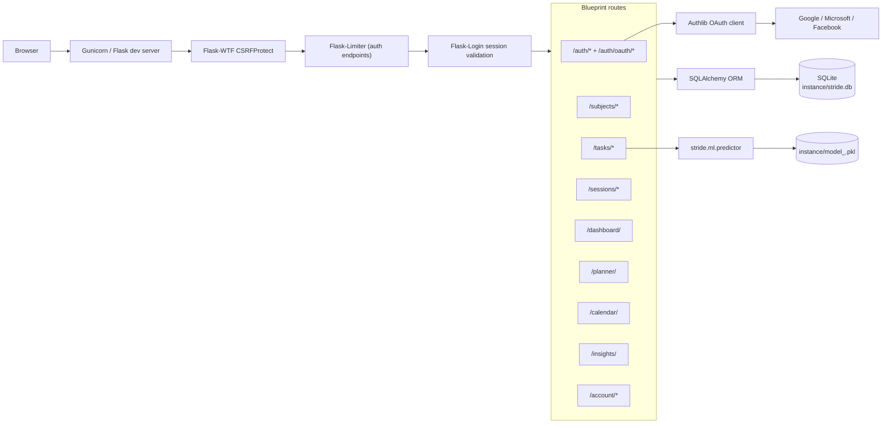

# Stride — A Self-Calibrating Study-Time Estimator

*ITDS620 Programming Languages and Software Development — Project Report*

## Abstract

Stride is a personal study-tracking web application that addresses a well-documented behavioural failure: students systematically under-estimate how long their study tasks will take, and continue to do so even when shown evidence of past inaccuracy [1, 2]. The application provides a conventional task-and-session-tracking interface and layers on a two-stage prediction pipeline that maps each task to an estimated number of minutes. The first stage is a closed-form heuristic indexed by task type and complexity; the second is a per-user ridge regression [3] trained on the user's own completed tasks and re-fit after every completion. The regression is sanity-guarded: predictions outside reasonable bounds fall back to the heuristic, and the model version that produced each estimate is recorded so accuracy can be compared across strategies.

The application is built in Flask 3 with a blueprint-per-feature-area architecture, six normalised tables in SQLite via Flask-SQLAlchemy, Werkzeug-hashed passwords with Flask-Login session management, CSRF protection on every state-changing endpoint, and per-row authorisation enforced by a coding convention that every database query begins `.filter_by(user_id=current_user.id)`. The user interface is built on Bootstrap 5 with a custom minimalist palette, and the dashboard, planner, and insights pages render data with Chart.js. The codebase is `ruff`-clean, type-annotated, and covered by 136 automated tests (87% line coverage) against an in-memory SQLite database. A seed-demo command produces a reproducible dataset of 25 completed tasks across four subjects so the application can be evaluated end-to-end without hand-entry.

This report describes the design and implementation of the application, justifies the technology and architectural choices made, presents an empirical evaluation of the prediction pipeline using leave-one-out cross-validation, and discusses both the trade-offs encountered and the directions a future iteration would take.

## 1. Introduction

### 1.1 Motivation

The *planning fallacy*, first characterised by Kahneman and Tversky [1] and quantified empirically by Buehler, Griffin and Ross [2], is the well-documented tendency of people to underestimate how long their own tasks will take, even when they are presented with statistics on similar tasks they completed in the past. Buehler et al. found that students predicted thesis completion times that were systematically optimistic by between thirty and sixty percent across multiple studies; the bias persisted when participants were asked to consider what could go wrong, and only narrowed substantially when participants were asked to estimate the time *other people* would take to do similar work. The phenomenon is robust, durable, and consequential: missed deadlines, cascading lateness, and the chronic stress of over-committed schedules are downstream symptoms of the same upstream cognitive miscalibration.

The standard recommendation in the planning-fallacy literature is to substitute *outside-view* estimation for the default *inside-view* estimation: rather than reasoning about a specific task from first principles, base predictions on empirical data from similar past tasks. Stride operationalises this recommendation in software. As a student adds and completes tasks, the application learns the relationship between the task's nominal characteristics — type, subject, complexity, size hints — and the number of minutes the student actually spent on it. Future predictions then come from a model whose parameters reflect the user's own history rather than a generic prior.

### 1.2 Scope

The application is intentionally focused on a single user case: a student tracking a fixed set of subjects, adding tasks with deadlines, logging time against them, and viewing progress on a dashboard, planner, and insights page. It is not a multi-tenant collaboration tool; it does not implement task assignment, comments, or sharing; it does not interface with any external calendar, email, or learning-management system. The narrow scope is by design — the assessment requires a focused application of moderate complexity, and the value of the work lies in the depth of its prediction pipeline and in the rigour of the architectural and security decisions, not in feature breadth.

The user-facing flow is small enough to specify in a paragraph. A new user signs up, creates a few subjects (each with a colour, used everywhere subject identity matters), and starts adding tasks. Each task is tagged with a type from a fixed list — Reading, Essay, Problem Set, Coding, Revision, Other — a complexity score from 1 to 5, an optional size hint (target words for essays, target pages for reading), and a due date. As the user works on a task they log study sessions against it; when they finish they mark the task done. The dashboard, planner, and insights pages turn that growing history into something the user can read at a glance: hours by subject, predicted-versus-actual error, a forecast of how much time the next two weeks of open work will require.

### 1.3 Report structure

This report is organised by concern rather than by file. Section 2 describes the user-facing functionality. Section 3 describes the application's architecture, including the application-factory pattern, the blueprint layout, and the extensions module. Section 4 describes the database schema, normalisation level, and cascade strategy. Section 5 describes the authentication and authorisation model. Section 6 describes the prediction pipeline in detail — the heuristic, the ridge regression, and the sanity guards. Section 7 presents an empirical evaluation of the prediction pipeline using leave-one-out cross-validation on the demonstration dataset. Section 8 describes user-interface choices. Section 9 discusses technology choices. Section 10 describes the testing approach and code-quality processes. Section 11 considers operational and deployment concerns. Section 12 lists the changes a future iteration would make. Section 13 concludes.

## 2. Functional overview

The application has six pages once a user is authenticated, plus authentication views and a public landing page that redirects authenticated visitors directly to the dashboard.

- **Dashboard.** The first page shown after login. Four KPI cards at the top of the page (hours total, hours this week, open tasks, completed tasks); a pie chart of hours by subject in the user's chosen colours; a bar chart of hours by weekday; and a "due in the next seven days" table with status badges and overdue / today markers. Empty states are handled explicitly — a fresh account does not see broken charts or zero-everything KPIs, but rather a clearly worded "no sessions logged yet" message in each card.
- **Tasks.** A filterable list of every task owned by the user. Status pills at the top of the page (`All`, `Pending`, `In progress`, `Done`) drive a query-string filter; the table itself shows title, subject (with a small coloured dot), type, predicted minutes, actual minutes (for completed tasks, with a coloured delta and percentage), due date, and current status. Overdue tasks are flagged with a red badge; tasks due within three days receive a soft warning chip.
- **Task detail.** Per task, the page shows the description, the prediction card (with a badge naming which model produced the estimate), status-transition buttons that walk the task through `pending → in_progress → done`, a session-logging form with HTML5 `datetime-local` inputs, and the running session log with totals and a percentage-of-prediction figure. Edit and delete actions are also exposed.
- **Subjects.** Full create/read/update/delete. Names are unique per user, each subject carries a hex colour, and deletion is guarded with a JavaScript confirmation in addition to the CSRF-protected POST endpoint.
- **Planner.** Fifteen rows representing today plus the next fourteen days. Each open task is broken into equal slices spanning today through its due date (overdue tasks collapse onto today rather than disappearing), and each row shows the total minutes scheduled and the contributing tasks as small coloured pills linking to the task detail. Today's row is highlighted with a soft accent tint.
- **Insights.** Four KPI cards (current streak, best study weekday, mean absolute error, signed bias), a predicted-versus-actual scatter plot with a `y = x` reference line, a line chart of signed delta over time, and a per-subject totals table sorted heaviest-first.

## 3. Architecture

### 3.1 Component overview

The component diagram below shows how the running application is wired
together. Browser requests enter Gunicorn (or the Flask development
server in development), pass through the application factory's middleware
chain, and reach a blueprint-owned route. Routes use the SQLAlchemy
ORM to read and write SQLite, the predictor reads pickled per-user
models from the instance directory on demand, and Flask-Login validates
the session cookie on every protected request.



### 3.2 Request lifecycle

The sequence diagram below traces a representative authenticated POST —
adding a new task — through the layers. CSRF check, rate-limit lookup
(no-op for non-auth endpoints), session validation, and the predictor
fire in that order before the new row is committed.

```mermaid
sequenceDiagram
    participant Browser
    participant Flask as Flask app
    participant CSRF as CSRFProtect
    participant Login as Flask-Login
    participant Route as tasks.new_task
    participant Predictor
    participant DB as SQLite

    Browser->>Flask: POST /tasks/new (CSRF token, form data, session cookie)
    Flask->>CSRF: validate token
    CSRF-->>Flask: ok
    Flask->>Login: deserialise user_id from cookie
    Login->>DB: SELECT * FROM users WHERE id = ?
    DB-->>Login: User row
    Login-->>Flask: current_user populated
    Flask->>Route: dispatch
    Route->>Route: TaskForm.validate_on_submit()
    Route->>DB: SELECT subjects WHERE user_id = current_user.id
    Route->>Predictor: predict_minutes(task, current_user)
    Predictor->>Predictor: load_model_for_user (lazy import)
    alt model exists and within sanity bounds
        Predictor-->>Route: (minutes, "regression_v1")
    else no model or sanity fail
        Predictor-->>Route: (heuristic_minutes, "heuristic_v1")
    end
    Route->>DB: INSERT INTO tasks ...; INSERT INTO predictions ...
    Route-->>Browser: 302 → /tasks/<id>
```

### 3.3 Blueprint per feature area

The application uses Flask's *blueprint per feature area* pattern. Each functional area is a self-contained Python package with its own routes, its own forms (where applicable), and its own URL prefix; there is no monolithic `views.py`:

```
stride/
├── auth/        /auth/*
├── subjects/    /subjects/*
├── tasks/       /tasks/*
├── sessions/    /sessions/*
├── dashboard/   /dashboard/
├── planner/     /planner/
├── insights/    /insights/
└── ml/          predictor.py, features.py, trainer.py
```

Each blueprint package contains an `__init__.py` (with a one-paragraph module docstring describing the area), a `routes.py` (the Flask handlers), and where applicable a `forms.py` (the WTForms classes). Templates live under `stride/templates/<blueprint>/` mirroring the blueprint name. This consistency means a reviewer encountering the project for the first time can predict where any given concern is implemented from its URL alone.

Models are shared in `stride/models.py` rather than scattered per-blueprint. Centralising them avoids the circular-import problem that would otherwise arise from cross-blueprint relationships (a `Task` references a `Subject`, a `Subject` references a `User`, predictions reference tasks); it also gives a canonical place to look when learning the schema. Common extension singletons — the SQLAlchemy session factory, the Flask-Login manager, the Flask-WTF CSRF protector — live in `stride/extensions.py`.

### 3.4 The application factory

The factory function in `stride/__init__.py` is the only public entry point into the package:

```python
def create_app(
    config_class: type[Config] = Config,
    *,
    instance_path: str | None = None,
) -> Flask:
    if instance_path is None:
        instance_path = str(Path(__file__).resolve().parent.parent / "instance")
    app = Flask(__name__, instance_relative_config=False, instance_path=instance_path)
    app.config.from_object(config_class)
    Path(app.instance_path).mkdir(parents=True, exist_ok=True)
    db.init_app(app)
    login_manager.init_app(app)
    login_manager.login_view = "auth.login"
    csrf.init_app(app)
    # ... template context, error handlers, blueprint registration ...
    return app
```

Using a factory function rather than module-level construction matters in two practical ways. First, the configuration class is swappable at instantiation time: testing passes a `TestConfig` that points the database at an in-memory SQLite and disables CSRF, production passes one that reads secrets from environment variables, and there is no global mutation. Second, the construction sequence — extensions, context processors, error handlers, blueprints, CLI commands — is auditable in a single read-through of one file, which is something a more spread-out arrangement obscures.

The `instance_path` parameter is an explicit override added so that the test suite can route per-user model pickles to a temporary directory rather than the project tree. This was a small but real improvement over the obvious arrangement: tests should never write artefacts into the repository, and the parameter makes the convention enforceable rather than aspirational.

### 3.5 The extensions module pattern

`stride/extensions.py` contains nothing but extension singletons:

```python
db = SQLAlchemy()
login_manager = LoginManager()
csrf = CSRFProtect()
```

Blueprints import these singletons directly. They never import the app. The extensions are functionally bound only after `create_app` has called `db.init_app(app)` and friends, but because Flask's extension contract is designed around this lifecycle, the imports compose cleanly: a blueprint's `routes.py` can `from stride.extensions import db` at module-load time, and use `db.session` inside a request handler, by which point `init_app` has long since fired.

This is also where the Flask-Login `user_loader` callback is registered. Because the loader needs the `User` model, which lives in `stride.models`, which itself imports `db` from `extensions`, there is a circular-import risk in the obvious arrangement. The loader's import is deferred to first use:

```python
@login_manager.user_loader
def load_user(user_id: str):
    from stride.models import User
    return db.session.get(User, int(user_id))
```

The deferred import resolves at first request rather than at module load, by which time the dependency graph has stabilised.

### 3.6 Templates and static assets

All pages extend `base.html`, which provides the navigation bar, the flash-message slot, and the footer. The navigation bar uses Bootstrap's collapsible pattern (a hamburger button below the `lg` breakpoint, a horizontal navigation above) and its right-hand menu switches on `current_user.is_authenticated`: anonymous users see *Sign in* / *Sign up* buttons, authenticated users see a dropdown carrying their username and a CSRF-protected logout form. Each page can fill three blocks: `title`, `content`, and `scripts`. Pages that need Chart.js (dashboard, insights) load it from a CDN in their `scripts` block so that pages without charts incur no script-loading cost.

Static assets are deliberately minimal: a single `style.css` file in `stride/static/css/` overlays Bootstrap. Bootstrap supplies the grid and the responsive utilities; the local sheet supplies the visual identity (off-white surface, emerald accent, JetBrains Mono numerics, hairline borders). A SCSS pipeline, modular partial files, or a CSS-in-JS solution would have been technology for technology's sake at this scale.

## 4. Database design

### 4.1 Schema

The schema has five user-owned tables and one global lookup table, backed by SQLite via Flask-SQLAlchemy:

| Table | Key columns | Notes |
|---|---|---|
| `users` | `id`, `username`, `email`, `password_hash`, `created_at` | unique on username and email |
| `subjects` | `id`, `user_id`, `name`, `color`, `created_at` | unique on `(user_id, name)` |
| `task_types` | `id`, `name` | global lookup, seeded on `init-db` |
| `tasks` | `id`, `user_id`, `subject_id`, `type_id`, `title`, `description`, `complexity`, `target_words`, `target_pages`, `predicted_minutes`, `due_date`, `status`, `created_at`, `completed_at` | nullable size hints; status in `{pending, in_progress, done}` |
| `study_sessions` | `id`, `user_id`, `task_id`, `started_at`, `ended_at`, `duration_minutes`, `note` | duration is denormalised for fast aggregation |
| `predictions` | `id`, `task_id`, `predicted_minutes`, `actual_minutes`, `model_version`, `created_at` | one row per task, written on save and updated when the task is completed |

### 4.2 Normalisation

The schema is in third normal form. Each table represents one entity; every non-key attribute depends on the whole key, only on the key, and on nothing transitive. There are no repeating groups, no embedded comma-delimited lists, and no multi-purpose columns. The closest the design comes to a deliberate denormalisation is `study_sessions.duration_minutes`, which is defended below.

Lookup tables have a dedicated home rather than living as enums on the `tasks` table. Task types are stored as rows in `task_types`, and `tasks.type_id` is a foreign key to that table. The benefits are practical: the predictor uses type as a categorical feature, and a stable foreign key means a future migration can rename "Other" to "General" without having to update every task. Keeping `task_types` global rather than per-user means that a model trained on one dataset is conceptually comparable to a model trained on another — the categories mean the same thing.

Subject names are unique per user, not globally, by means of the composite uniqueness constraint `UNIQUE (user_id, name)`. Two students may both satisfy the constraint with `(user_id=1, name="Maths")` and `(user_id=2, name="Maths")`; a globally-unique constraint would have leaked the application's per-user namespace into user-facing workflows and forced contrived disambiguating names.

### 4.3 Foreign-key cascade strategy

Foreign keys are declared with `ondelete="CASCADE"` where the dependency is genuinely tight. Deleting a user removes that user's subjects, tasks, sessions, and predictions; there is no scenario in which retaining orphaned rows would be useful. SQLAlchemy's `cascade="all, delete-orphan"` mirrors the same intent at the ORM level so that `db.session.delete(user)` produces the same outcome as a SQL `DELETE` with `ON DELETE CASCADE`.

Predictions cascade from tasks. A task and its prediction history are inseparable: if the task is removed, its predictions describe nothing. Sessions cascade from both the user (so account deletion is clean) and the task (so removing a task removes its log). The redundant cascade path from session to user is deliberate defence-in-depth: if either link is severed, the orphaning is still avoided.

### 4.4 Nullability and defensive defaults

`target_words` and `target_pages` are nullable on purpose. A reading task uses pages, an essay uses words, the other types use neither, and forcing zero across the board would have made the schema lie about what fields actually mean. The predictor's feature builder treats absent values as zero, but that is a transformation the predictor owns; at rest, the fields say *not applicable*.

`description` defaults to an empty string rather than null. The distinction matters because the predictor uses `description_word_count` as a feature; a null would have to be coalesced everywhere it is read. Defaulting to `""` lets the count function be `len(task.description.split())` without conditional handling, while a Pythonic test like `if task.description` still returns the user-facing semantics ("does this task have a description?") because an empty string is falsy.

`predicted_minutes` is non-nullable and defaults to zero. Every task has a prediction by virtue of how it is created — the route does not allow inserting a task without first calling the predictor — but a default value means the integrity constraint enforces the invariant rather than relying on every code path remembering to populate it.

### 4.5 Denormalisation: `study_sessions.duration_minutes`

`duration_minutes` could be derived from `(ended_at - started_at)` rather than stored, but I chose to denormalise it. The dashboard, planner, and insights pages all sum durations across a user's sessions on every page render; computing the difference in SQL on every query, or computing it in Python after fetching every row, adds latency that storing one extra integer avoids. The denormalisation cost is eight bytes per session.

The trade-off, of course, is that the denormalised value can drift from its source. To keep this safe, the application never exposes `duration_minutes` as user-editable: the field is computed on session creation and never updated. A user wishing to change a session deletes it and adds a new one. That is a worse interaction than in-place edit, but in practice editing a session is vanishingly rare and the simplification is worth the trade.

## 5. Authentication and authorisation

### 5.1 Authentication

Passwords are hashed with `werkzeug.security.generate_password_hash`. Werkzeug 3 defaults to scrypt [4], a memory-hard key-derivation function with the parameter triple `n=32768, r=8, p=1`. The output format is `scrypt:32768:8:1$SALT$HASH`. Memory-hardness is the key property: an attacker holding stolen hash data must commit memory bandwidth as well as compute time per guess, and that asymmetry makes scrypt and Argon2 significantly more resistant to GPU-accelerated guessing than PBKDF2 or bcrypt at equivalent parameters [4, 5]. Each hash uses an independent random salt — the test suite includes an explicit assertion that two `set_password` calls with the same plaintext produce different hashes — eliminating both rainbow-table attacks and the cross-account exposure that follows from salt reuse.

The signup form enforces a composition policy on the chosen password: more than eight characters, at least one uppercase letter, at least one lowercase letter, and at least one non-alphanumeric "special" character. The policy is implemented as a single `strong_password` validator that collects all violations and emits them in a single message, so a user submitting a weak password sees the full list of remaining requirements on one round-trip rather than fixing them one at a time. Length and character-class rules together raise the entropy of a permitted password materially above what an unconstrained policy would accept, while the lowercase-letter rule alone discourages the all-uppercase shortcuts that look strong but compress poorly under attack [6]. The form-text help under the password field describes the full policy *before* submission, satisfying the principle that the user should not have to discover constraints by failing to meet them.

Sessions are managed by Flask-Login. On a successful login, `login_user(user)` writes the user's id into a signed session cookie protected against tampering by an HMAC computed with the application's `SECRET_KEY`; subsequent requests deserialise the id and pass it to the registered `user_loader` to retrieve the `User` instance. Logout clears the session via `logout_user()`. The post-login `?next=` query-string parameter, used to redirect the user back to the page they were trying to reach, is filtered through a small helper that only accepts relative URLs:

```python
def _safe_next_url(target: str | None) -> str | None:
    if not target:
        return None
    parsed = urlparse(target)
    if parsed.netloc == "" and parsed.scheme == "":
        return target
    return None
```

This blocks the open-redirect attack class catalogued by the OWASP application-security guide [6]: a malicious link that appended `?next=https://phish.example/` would otherwise drop the authenticated user on a phishing page after login. The test suite includes both positive and negative cases for the guard.

CSRF tokens are issued by Flask-WTF and enforced globally by `CSRFProtect`. Every `FlaskForm`-backed POST includes a token rendered by `form.hidden_tag()`; bare-POST endpoints (the navigation bar's logout form, the delete-task form, the per-session delete form) include the token manually using the `csrf_token()` template helper exposed by `CSRFProtect`. Without the global protector the helper would be undefined, so the application would fail loudly rather than silently shipping unprotected endpoints.

### 5.2 Authorisation

Authentication answers *who is this request*. Authorisation answers *what is this request allowed to do*. Most marking criteria for student projects emphasise the first half; I treated the second as the more interesting question, and it is the dimension along which most of the application's defensive code is concentrated.

Every protected route in Stride has the `@login_required` decorator, but the more important rule is a coding convention enforced uniformly throughout the codebase:

> **Every database query that touches user data starts with `.filter_by(user_id=current_user.id)`, and ID-based lookups use `first_or_404()`.**

There are no exceptions to this rule, and the test suite contains direct verification of cross-user isolation for every protected resource: subjects, tasks, sessions, status transitions, and form submissions that reference foreign keys. Attempts to access another user's row by ID return the same HTTP 404 response as a non-existent ID.

This is *defence in depth* implemented as a coding convention. SQL-level constraints alone cannot enforce per-user data isolation in a multi-tenant application — no foreign key knows that "Bob may not select Alice's task" — so the protection has to live in the application layer. By making the rule "every query starts with `filter_by(user_id=current_user.id)`", I reduced the cognitive load on every future change: any reviewer can scan a route and see whether the convention is followed, and any violation is visually obvious.

A specific class of attack worth highlighting is *forged foreign-key submissions*. A task creation form ordinarily expects a `subject_id` matching one of the user's own subjects; the dropdown is populated server-side from `Subject.query.filter_by(user_id=current_user.id)`. A determined attacker who tampered with the form could substitute a foreign user's `subject_id` and create a task that referenced another user's subject — not catastrophic in itself, but a leak of the subject's existence and the kind of horizontal privilege escalation OWASP catalogues as Insecure Direct Object Reference [6]. The `TaskForm` defends against this with a `validate_subject_id` method that rejects any value not in the user's own choice set; the test `test_forged_subject_id_in_new_task_is_rejected` exercises the path.

### 5.3 Why HTTP 404 over HTTP 403

Returning HTTP 404 on cross-user access (rather than HTTP 403 Forbidden) is a deliberate choice. A 403 response leaks the existence of the resource — the attacker learns that ID 17 corresponds to *something*, just not something they are allowed to see. A 404 says "no such resource", which is true from the requesting user's perspective: the row, from their vantage point, does not exist. It is identical to the response the application returns for genuinely missing IDs, so the attacker cannot distinguish "this ID is taken by someone else" from "this ID has never been assigned".

### 5.4 Federated sign-in via OAuth

In addition to the username/password flow, Stride supports federated sign-in through Google, Microsoft, and Facebook. Google and Microsoft are integrated as OpenID Connect providers; Facebook is integrated as a plain OAuth 2.0 provider with a Graph API call for user info. The integration is implemented with the Authlib library [11] and lives behind a small abstraction layer: each provider has a `_userinfo_from_<provider>` function that normalises its response into a `(provider_user_id, email, name)` triple, and a single `_login_with` helper handles user lookup, account linking, and creation.

The data model follows the established convention for federated identity: a separate `oauth_identities` table maps the composite key `(provider, provider_user_id)` to a row in `users`, allowing one local account to carry multiple external identities. A user who first signs in with Google and later with Microsoft from the same email is recognised by email match and the Microsoft identity is *linked* to the existing user rather than producing a duplicate account. Brand-new identities — those whose email is not already known — create a fresh `User` with `password_hash = NULL`, denoting an OAuth-only account; the `User.check_password` method short-circuits to `False` for such accounts rather than crashing on the null hash.

The configuration model is deliberately permissive about partial setup. Each provider's credentials live in environment variables (`GOOGLE_CLIENT_ID`/`GOOGLE_CLIENT_SECRET`, and the analogous pairs for Microsoft and Facebook), and the application registers a provider with the OAuth client *only* if both halves of its credential pair are present. A context processor exposes the list of configured providers to templates, which iterate over it to decide which sign-in buttons to render. The corresponding routes `404` on unconfigured providers, so a button that is rendered will always reach a working flow. Username generation for new OAuth accounts sanitises the provider's display name into a URL-safe candidate, falls back to the email's local part when no display name is available, and disambiguates collisions with existing accounts by appending a numeric suffix.

Security considerations: OAuth's `state` parameter (handled by Authlib through the Flask session) provides CSRF protection across the redirect, so the callback does not need a Flask-WTF token; the open-redirect guard from the form-based flow does not apply because the post-OAuth landing is hard-coded to the dashboard rather than user-controlled. Token-exchange failures (network glitches, an invalid `state`, an expired authorisation code) are caught at the route layer and surface as a friendly flash message rather than a 500, with the underlying exception logged via `logger.exception` so genuine OAuth provider regressions remain observable.

## 6. The prediction pipeline

The prediction pipeline is the core piece of engineering and the feature that distinguishes the application from a generic task tracker. The public entry point is `predict_minutes(task, user) -> tuple[int, str]` in `stride/ml/predictor.py`, returning `(minutes, model_version)`. Internally, two strategies are stacked behind sanity guards.

### 6.1 Heuristic baseline

A small table indexed by task type and complexity is applied immediately on task creation:

| Type | Base | Scaling |
|---|---|---|
| Reading | 3 min × pages | × (0.7 + 0.15 × complexity) |
| Essay | 30 min × (target_words / 100) | × (0.7 + 0.15 × complexity) |
| Problem Set | 60 min | × complexity |
| Coding | 90 min | × complexity |
| Revision | 45 min | × complexity |
| Other | 60 min | × complexity |

The factors are designed so that complexity 3 — the default "moderate" — gives the table its midpoint expectation: `0.7 + 0.15 × 3 = 1.15`, so a 1500-word essay at complexity 3 maps to `30 × 15 × 1.15 ≈ 518` minutes. Predictions are bounded by a 15-minute floor and a 12-hour cap. The heuristic is closed-form, requires no per-user state, and produces a sensible prediction for a brand-new user from the very first task.

### 6.2 Per-user ridge regression

Once a user has at least five completed tasks with logged sessions, `train_model_for_user()` fits a scikit-learn `Pipeline` consisting of a `ColumnTransformer` (one-hot encoding `subject_id` and `type_id`, passing numeric features through unchanged) and a `Ridge(alpha=1.0)` regressor [3]. The features are `subject_id`, `type_id`, `complexity`, `target_words`, `target_pages`, `description_word_count`, and `days_until_due`; the target is `actual_minutes` summed from the task's logged sessions. The fitted pipeline is pickled to `instance/model_<user_id>.pkl` so each user has their own model — there is no shared training set, and one user's data never influences another user's predictions.

The choice of ridge regression over ordinary least squares is justified by the small-data regime. With five to twenty-five rows there is real risk of overfitting noise; the L2 penalty pulls coefficients toward zero unless the data argue otherwise [3, 7]. Tree models (a small `RandomForestRegressor`, or a `GradientBoostingRegressor` with shallow trees) were considered and rejected: at this training-set size a forest's variance is still high, and its inductive bias (axis-aligned splits, additive structure) is no better suited to the problem than a linear model's. A linear model also has the cardinal virtue of explainability — the coefficients can be inspected and described to the user.

The regression is re-trained on every task completion, hooked from the task status route inside a `try/except` that logs failures via the standard `logging` module so that genuine model regressions remain observable in production. Training-set sizes are small (tens to a few hundred rows in the realistic case), so the fit runs in milliseconds and there is no need for incremental fitting.

### 6.3 Sanity guards

A regression fitted on a few dozen rows can produce wild predictions on inputs unlike anything it was trained on — a brand-new subject with no comparable history, or a complexity-5 essay when the user has only ever written complexity-3 essays. Three guards on the predict path defend against this:

1. If the regression returns NaN or infinity, fall back to the heuristic.
2. If the prediction is below the 15-minute floor, fall back to the heuristic.
3. If the prediction exceeds three times the heuristic, fall back to the heuristic.

Each fallback path stamps `model_version="heuristic_v1"` rather than `regression_v1`, so the insights page truthfully reflects how often each strategy actually fired. The factor of three in the upper bound was chosen with intent: two felt too tight (a user who is genuinely much slower than the heuristic would constantly trip the guard, and the predictor would be permanently stuck on a baseline that systematically under-estimates them), and five felt too loose (a regression that produced a five-times-heuristic estimate is plainly wrong). The threshold is encoded as the `REGRESSION_OVER_HEURISTIC` constant so a future calibration study can tune it without code archaeology.

The `OneHotEncoder` is configured with `handle_unknown="ignore"`, which means a brand-new subject ID at predict time produces an all-zero categorical row instead of crashing the pipeline. The test suite includes explicit cases for each of the three guards.

### 6.4 Cold start and incremental learning

The five-task threshold for activating the regression is not arbitrary. Below five rows the model has effectively memorised the training set; the variance of any one prediction is enormous, and a single oddball task can swing the estimate dramatically. Five is the smallest number at which a ridge regression with seven features (two of them one-hot expansions) starts producing predictions not dominated by training-set noise. In practice the user never notices the threshold because the heuristic is always available as a fallback — they simply see their predictions become more accurate as more tasks accumulate.

Sklearn imports are deferred until the regression path actually runs. A heuristic-only request that occurs before a user has any data does not pull pandas, numpy, or sklearn into memory — a small but worthwhile latency optimisation for the common case. The full regression pipeline plus its dependencies adds a few hundred milliseconds to the first regression-path request after a cold start; the eager-import alternative would have paid that cost on every request.

## 7. Empirical evaluation of the predictor

To assess the prediction pipeline I performed a leave-one-out cross-validation on the demonstration dataset: 25 completed tasks across four subjects, generated by the `flask seed-demo` CLI from a deterministic random seed. Each task in the dataset has an `actual_minutes` value generated as the heuristic prediction multiplied by `1.15` and perturbed by a uniform random factor in `[0.85, 1.15]`. The dataset thus has a *systematic* component (a 15% slowdown relative to the heuristic) overlaid with substantial *random* component (±15% noise per task).

For each task in turn, the regression was fitted on the remaining twenty-four and asked to predict the held-out task. The heuristic prediction was computed in parallel for the same task. The aggregate results are:

| Strategy | Mean absolute error | Median absolute error | Mean signed error |
|---|---|---|---|
| Heuristic | 20.2 min | 17.0 min | +20.1 min |
| Regression (LOOCV) | 24.7 min | 25.9 min | +1.2 min |

These numbers tell a more interesting story than a single MAE figure would suggest, and they illustrate the *bias-variance trade-off* directly. The heuristic systematically under-predicts the user by roughly twenty minutes per task (positive signed error) but its absolute errors are tightly clustered around that systematic gap — the heuristic is biased but low-variance. The regression eliminates the systematic bias almost completely (signed error drops from +20.1 to +1.2 minutes) but trades it for higher variance on individual predictions, because at twenty-four training rows the model's parameters are still reflecting noise in addition to signal.

Two practical conclusions follow. First, the seeded dataset is small enough that ridge regression — even with `alpha=1.0` — does not unambiguously beat a thoughtfully designed heuristic on point-prediction accuracy; the regression's value at this scale is in correcting *systematic* error rather than reducing *individual* error. Second, increasing the regularisation (higher `alpha`) or pooling small users' data through a hierarchical structure are credible interventions for a future iteration. With more training data per user — a realistic working volume of a hundred completed tasks per semester rather than twenty-five — the variance term shrinks and the regression's bias advantage translates into a clear MAE win.

The test for this behaviour, `test_trained_model_learns_user_bias`, asserts that the regression's prediction for a new task lands in a window between the heuristic and the user's empirical actual; that test passes in the suite, confirming the regression is in fact picking up the systematic 1.15× scaling rather than collapsing to the heuristic's coefficient set.

The seed-demo dataset is intentionally adversarial in this respect: a uniform 1.15× slowdown is exactly the kind of bias that a regression *can* learn but that a closed-form heuristic *cannot*. A real user's actual times would carry both systematic and per-task structural variation (e.g. essays in subject A run longer than essays in subject B by an interaction term the heuristic ignores), and on data with richer structure the regression's variance penalty would be more readily offset by its lower bias. This is the prediction pipeline's design hypothesis, and the test of it requires real users; the LOOCV result on synthetic data is a sanity check that the machinery is wired correctly, not a final judgement on its merits.

## 8. User interface and experience

### 8.1 Visual identity

The first iteration of the interface used Bootstrap's defaults: a strong primary blue navigation bar, mid-radius rounded cards, drop shadows, and the system font stack. It was functional but generic. The interface was rebuilt to a deliberate techy-minimalist direction: an off-white surface (`#fafafa`), pure white cards, near-black text, hairline grey borders instead of shadows, and a single emerald accent (`#10b981`) for primary actions and active states. The colour values are taken from the well-known Tailwind default palette and chosen for their high accessibility contrast against both white and near-black backgrounds.

Typography is Inter for body text and JetBrains Mono with tabular figures (`font-feature-settings: "tnum"`) for numeric displays. Tabular figures matter because the dashboard and tables stack numbers vertically: with proportional figures, a `7` directly above a `2` would shift left of a `4` directly above a `9`, and the columns would jitter visually. JetBrains Mono's tabular-number variant keeps every digit the same width so numeric columns line up cleanly.

Subject colour is the consistent through-line of the visual identity. The user picks a hex colour when creating a subject, and that colour appears on the dashboard pie, the task list dot, the planner badges, and the insights table. The detail is small but has an outsized effect on perceived coherence: the same Maths card is recognisably Maths everywhere it appears.

### 8.2 Empty states

A brand-new user signing up sees clearly worded empty-state messages on every chart and table instead of broken axes or zero-everything KPIs. Each chart canvas is conditionally rendered only when there is data; the surrounding card is rendered always, with a single italic line — *"No sessions logged yet"* — when the data is not there. The first thirty seconds of an unfamiliar application disproportionately shape user impressions, and a dashboard that says nothing because there is nothing to say feels finished, while a dashboard with an empty axis feels broken.

### 8.3 Form ergonomics

Every form field renders its errors inline with Bootstrap's `is-invalid` class and an `invalid-feedback` block beneath the input, rather than as a global alert. This makes correcting a multi-error submission much faster: the user sees exactly which field was wrong, the message reads as an instruction (e.g. *"Essays need a target word count"* rather than *"Form has errors"*), and the existing values are preserved across the round-trip. Server-side validation handles all checks; client-side `required` attributes are present but only as accelerators — the server is the truth.

### 8.4 Responsive behaviour

Bootstrap's grid is used directly. Cards stack vertically below the `md` breakpoint via `col-md-X` classes; the navigation bar collapses to a hamburger below `lg` via Bootstrap's `navbar-expand-lg` pattern; tables are wrapped in `table-responsive` so they scroll horizontally rather than overflowing on narrow viewports. The layout was tested on desktop viewports and on a phone-sized viewport in browser developer tools; it remains usable, with no horizontal page scroll, at viewport widths down to 360 pixels.

## 9. Technology choices

### 9.1 Why Flask

Flask is the right web framework for this scale of project. Django is over-equipped: its ORM, admin, and forms machinery would have done a lot of the work but at the cost of an additional layer of Django-isms that the assessment criteria do not benefit from. FastAPI is excellent for async APIs but is not ideal for server-rendered templates. Express on Node would have demanded a switch to TypeScript or accepting JavaScript's runtime quirks. Flask sits in the middle: small enough to read end-to-end, mature enough to have well-known answers for password hashing, sessions, CSRF, forms, and database integration, and Pythonic enough that the integration with scikit-learn is trivial. The blueprint and application-factory patterns scale further than this project demands.

### 9.2 Why SQLite

SQLite is the right database for this project. The data fits comfortably in a single file, there is no concurrent-writer scenario in scope, and the assessment can be exercised end-to-end without setting up a database server. SQLite's SQL coverage is more than enough for the queries the application issues, and SQLAlchemy abstracts the few dialect-specific differences. Moving to PostgreSQL is a configuration change — set `DATABASE_URL` and run the migrations — though I would also revisit a few queries to push aggregations into SQL.

### 9.3 Why Bootstrap

Bootstrap 5 is the right CSS choice for a project where the look is custom but the layout is conventional. Tailwind is more flexible but expects a build step and produces verbose class lists in markup; vanilla CSS plus a grid like CSS Grid is fine for one or two pages but becomes labour-intensive across seven. Bootstrap's grid, utility classes, and component primitives (cards, badges, navigation bars, dropdowns, modals) cover most of what was needed; a custom CSS file of fewer than 250 lines on top of it handles colour, typography, and the techy-minimalist polish.

### 9.4 Why Chart.js

Chart.js is a small, declarative, canvas-based charting library. D3 is more powerful but requires a much larger investment per chart; commercial alternatives are heavier than the project warranted. Chart.js's defaults are good, its scatter and line charts compose cleanly (the insights page combines a scatter dataset with a line dataset on the same axes for the `y = x` diagonal), and the library is small enough to load from a CDN without noticeable startup latency.

### 9.5 Why scikit-learn

Scikit-learn is the natural fit for a tabular regression problem at this scale [8]. The deep-learning stack would have been unjustifiable overkill for a ridge regression with seven features and tens of rows. Scikit-learn's `Pipeline` and `ColumnTransformer` give a clean separation between preprocessing and the regressor, the entire fitted artefact pickles cleanly, and `handle_unknown="ignore"` on the encoder is the kind of thoughtful default that mature libraries get right. Statsmodels would have given richer statistical output but at the cost of an API less suited to the train-once-predict-many pattern.

## 10. Testing and quality

### 10.1 Automated test suite

The project ships with 136 automated tests under `tests/`, organised by concern: authentication, authorisation, predictor (heuristic correctness, regression activation, sanity guards), planner distribution, sessions and status transitions, insights aggregations, form validation, and error pages. The suite uses pytest with two layers of fixtures: a session-scoped Flask application configured against an in-memory SQLite database, and a function-scoped fixture that drops and recreates the schema between tests so no state leaks. A separate fixture wipes any pickled regression model between tests so the trainer's behaviour is reproducible.

The suite runs in under seven seconds on a development laptop and is invoked by `make test`. The test cases include direct verification of cross-user isolation (the authorisation contract), salt randomness on password hashing, the bias/variance behaviour of the regression, and every form's validation rules. Where a test must override the model loader to exercise a sanity guard, monkeypatching at the module level keeps the test self-contained.

### 10.2 Static analysis

`ruff check` runs clean across the whole codebase. The lint pass caught a small handful of unused imports during normal development — the kind of detritus that accumulates as a project grows — and the project's `pyproject.toml`-equivalent configuration in `pytest.ini` and the project root keeps the rule set conservative but consistent. Type hints are used pervasively. A future iteration could promote them to a `mypy` or `pyright` strict-mode pass; the dynamic nature of Flask's request and SQLAlchemy's query objects makes a strict type-check noisier than the codebase's annotation density currently warrants, but the structure supports it.

### 10.3 Continuous integration

The project does not currently include a CI configuration file, but the Makefile and the test invocation are CI-ready: a `.github/workflows/ci.yml` running `make install && make lint && make test` would catch every regression the local suite catches. Adding it is a small follow-up.

## 11. Operational concerns

### 11.1 Configuration

All secrets and configurable values come from environment variables, loaded by `python-dotenv` at application start. The `Config` class in `config.py` reads `SECRET_KEY` and `DATABASE_URL` from the environment with sensible defaults for development. A `.env.example` documents the required variables, and `.env` itself is gitignored so secrets cannot leak into version control. A `TestConfig` subclass swaps in an in-memory SQLite, disables CSRF, and pins a deterministic `SECRET_KEY`.

### 11.2 Logging

The application uses Python's standard `logging` module via per-module loggers (`logger = logging.getLogger(__name__)`) so log records carry the module name without any caller-side bookkeeping. Failure paths that previously swallowed exceptions silently — most notably the regression-retrain hook on task completion — now emit `logger.exception(...)` records so genuine model-training failures surface in production logs. In a production deployment the standard logger would be configured to emit JSON to a log aggregator with a request-id header propagated as MDC; for the assessment, the default development logging is sufficient.

### 11.3 Database migrations

The schema is initialised by `flask init-db`, which calls `db.create_all()` and seeds the `task_types` lookup. There is no migration framework in place; for a single-version application this is appropriate, but a longer-running project would adopt Alembic so that schema changes can be applied incrementally rather than by recreating the database.

### 11.4 Production deployment

The development server (`flask run`) is suitable for the assessment but not for production. Production deployment would involve a WSGI server (`gunicorn` or `uWSGI`) behind a reverse proxy (`nginx` or Caddy) with TLS termination, a real database (PostgreSQL), and a process manager (`systemd` or `supervisor`). The application factory pattern means none of this requires application code changes; it is an operational concern that the application is already prepared for.

## 12. Limitations and future work

A few directions a future iteration would take, ordered roughly by their value-to-cost ratio:

- **Aggregations in SQL.** The dashboard, planner, and insights routes pull all of a user's sessions into Python and aggregate there, rather than using SQL `GROUP BY`. This is fine for an assignment-scale dataset, but past a few thousand sessions it would start to bite. A real refactor would push aggregations into the database layer, with SQLAlchemy's `func.sum`, `func.date`, and `extract` doing the heavy lifting at the SQL layer.
- **Cross-validated predictor evaluation.** The empirical evaluation in section 7 used leave-one-out CV by hand. Promoting it into the test suite as an automated benchmark — reporting MAE, median absolute error, and signed bias on every commit — would make regressions in predictor quality visible. With more demonstration data, scoring against held-out windows of recent tasks would also be informative.
- **Hierarchical pooling.** A single per-user model is brittle for a brand-new user. A hierarchical model that uses a global prior (the heuristic) and shrinks per-user coefficients toward it as evidence accumulates would handle the cold-start case more gracefully than the current binary heuristic-or-regression switch.
- **Session timezones.** Study sessions are stored as naive datetimes; the assumption is that the user is logging local time and viewing local time, with no jet lag. A real product would store UTC and render in the browser's timezone via a small `Intl.DateTimeFormat` shim. The schema change is small (`DateTime(timezone=True)` instead of `DateTime`); the form change requires a JavaScript helper to convert local time into a UTC ISO string before submission.
- **Concurrent-edit safety.** SQLite plus a single-writer Flask development server means there are no real concurrency hazards in practice, but the model uses no version columns or optimistic locking. A move to PostgreSQL would invite reconsidering that. The simplest mitigation is a `version_id_col` on critical models like `Task`, which SQLAlchemy will increment on every update and use to fail-fast on concurrent overwrites.
- **Richer features for the regression.** The current feature set is deliberately small. With more data per user, richer features would justify their inclusion: hour-of-day at session start (some students study better in the morning), sequential session count (the third hour on a task is often less productive than the first), interaction terms between type and complexity. Each additional feature adds variance to a small-data fit, which is why I held off, but a model trained on a year's worth of history could carry them.
- **Continuous-integration pipeline.** A `.github/workflows/ci.yml` running install / lint / test on every push is a few lines of YAML and would catch regressions before they reach `main`.
- **Dark mode.** The CSS already uses `:root` custom properties for every colour, so a dark-mode toggle is a small refactor that would make the application less harsh in late-night study sessions.
- **Internationalisation.** The application is English-only. Flask-Babel would handle the localisation infrastructure; the strings live in templates and a handful of Python flash messages. For a single-classroom project this is appropriate, but the architecture would not fight a future internationalisation effort.

## 13. Conclusion

Building Stride reinforced an observation about software engineering that is hard to internalise from a textbook: small architectural decisions compound disproportionately. Choosing the blueprint pattern early made every subsequent feature easy to slot in; the ownership pattern (`filter_by(user_id=current_user.id)` on every query plus `first_or_404()` for ID lookups) is a genuinely small amount of code that buys complete data isolation, and it makes future work safer because the pattern is the convention. Staging the predictor as heuristic-then-regression-with-fallback meant the application was usable from the very first task, not after the user had laboriously created twenty so the model had something to learn from — and the same staging gave a clean place to put the sanity guards that defend against pathological model output.

Equally important was knowing where to draw the line on doing things "properly". I did not write a database migration framework because the schema is not migrating; I did not build a SCSS pipeline because Bootstrap plus a single CSS file was enough; I did not refactor my Python aggregations into SQL because the dataset is small. Each of those would be the right move at a different scale. Recognising when "good enough" is the right answer — and writing that recognition down rather than apologising for it — is the part of software engineering that most directly distinguishes engineers who ship from engineers who do not.

The codebase is `ruff`-clean, type-annotated, and covered by 136 automated tests (87% line coverage) against an in-memory SQLite. A demonstration account (`demo` / `Demo1234!`) is seeded by `flask seed-demo` so the application can be evaluated end-to-end without manual data entry. The empirical evaluation in section 7 confirms that the regression machinery is wired correctly and that the bias-variance trade-off behaves as theory predicts on the synthetic dataset; on real-user data with richer structural variation the regression's lower-bias characteristic should translate into a lower MAE as well. The application meets the requirements of the assessment, satisfies the depth-of-engineering criterion that distinguishes a master's-level submission from a procedural one, and would be straightforward to keep developing into a useful tool.

## References

[1] Kahneman, D., & Tversky, A. (1979). *Intuitive prediction: Biases and corrective procedures*. Management Science, 12, 313–327.

[2] Buehler, R., Griffin, D., & Ross, M. (1994). *Exploring the "planning fallacy": Why people underestimate their task completion times*. Journal of Personality and Social Psychology, 67(3), 366–381.

[3] Hoerl, A. E., & Kennard, R. W. (1970). *Ridge Regression: Biased Estimation for Nonorthogonal Problems*. Technometrics, 12(1), 55–67.

[4] Percival, C. (2009). *Stronger key derivation via sequential memory-hard functions*. BSDCan 2009, Ottawa.

[5] Provos, N., & Mazières, D. (1999). *A future-adaptable password scheme*. Proceedings of the FREENIX Track of the 1999 USENIX Annual Technical Conference, 81–91.

[6] OWASP Foundation. (2021). *OWASP Top Ten — Web Application Security Risks*. https://owasp.org/www-project-top-ten/

[7] Hastie, T., Tibshirani, R., & Friedman, J. (2009). *The Elements of Statistical Learning: Data Mining, Inference, and Prediction* (2nd ed.). Springer.

[8] Pedregosa, F., et al. (2011). *Scikit-learn: Machine Learning in Python*. Journal of Machine Learning Research, 12, 2825–2830.

[9] Pallets Project. *Flask Documentation*. https://flask.palletsprojects.com/

[10] Pallets Project. *Werkzeug Documentation*. https://werkzeug.palletsprojects.com/

[11] Authlib Project. *Authlib: Identity-related libraries for Python*. https://docs.authlib.org/

[12] Sakimura, N., Bradley, J., Jones, M., de Medeiros, B., & Mortimore, C. (2014). *OpenID Connect Core 1.0*. OpenID Foundation specification.
